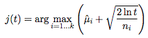
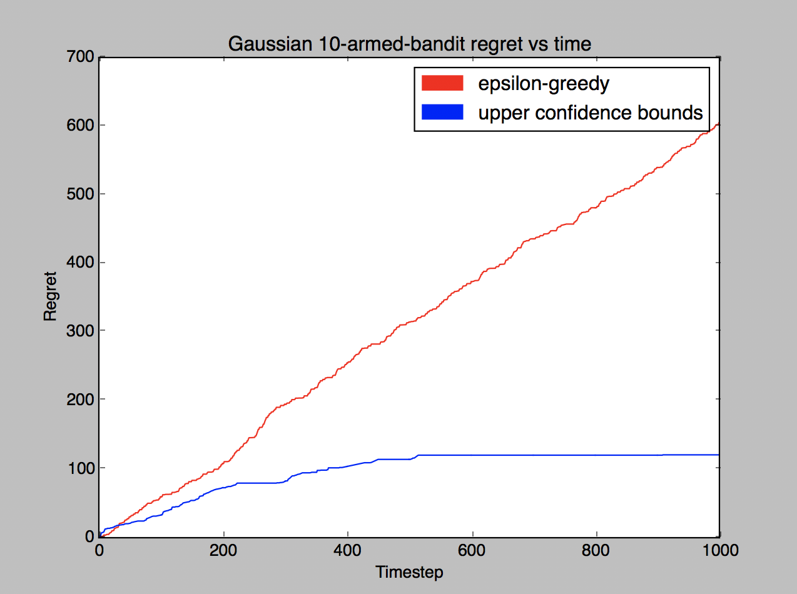

# Multi-armed bandit demonstration

The [multi-armed bandit](https://en.wikipedia.org/wiki/Multi-armed_bandit) is a problem in which there are a row of *k* slot machines (each with their own probability distribution), and a gambler has to decide which slot machines to play. This is a simple reinforcement learning problem.

In this repository, I use [OpenAI's Gym framework](https://gym.openai.com/) to implement two common approaches: the epsilon-greedy strategy and the upper confidence bounds strategy.

## Epsilon-greedy strategy

In this strategy, the algorithm chooses to "explore" with probability epsilon, while it "exploits" with probability (1 - epsilon). In this case, exploring corresponds to choosing a random slot machine, while exploiting corresponds to choosing the current highest sample mean slot machine.

## Upper confidence bounds strategy

In this strategy, each action is first chosen once, and then further actions are chosen according to the following equation:

Where mu_i corresponds to the sample mean for action i, n_i corresponds to the count for action i, and t is the timestep.

[It has been shown](http://homes.dsi.unimi.it/~cesabian/Pubblicazioni/ml-02.pdf) that this strategy yields an optimal solution to the problem.

## Results

As shown by the plot, the epsilon-greedy strategy achieves linear regret while the UCB approach yields logarithmic regret.
